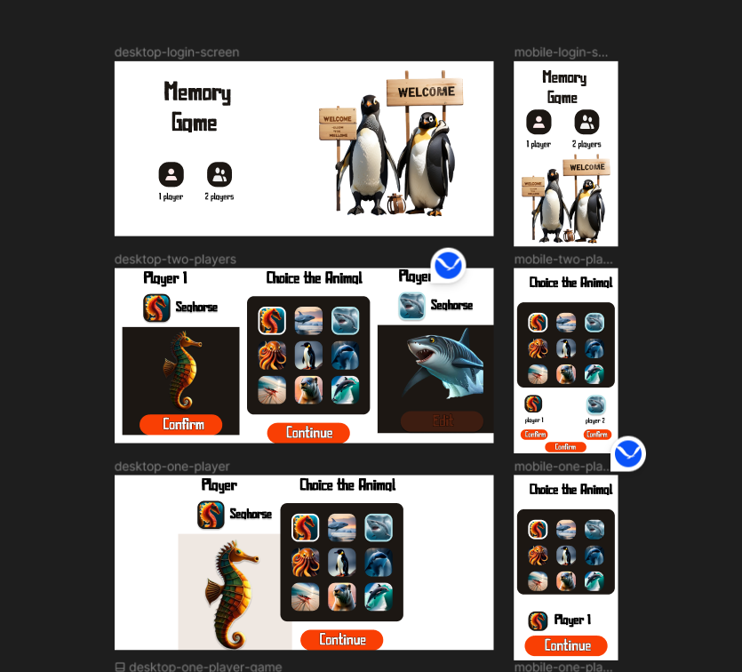
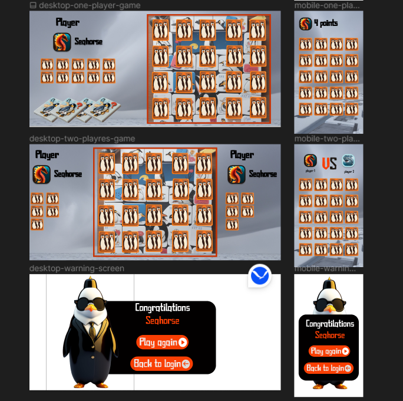
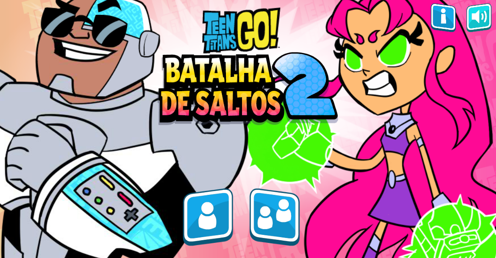
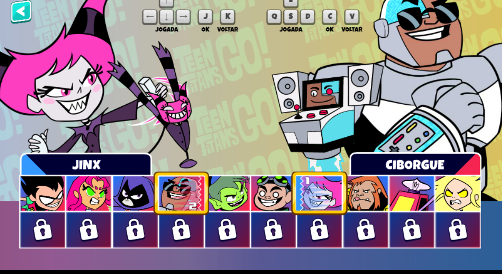
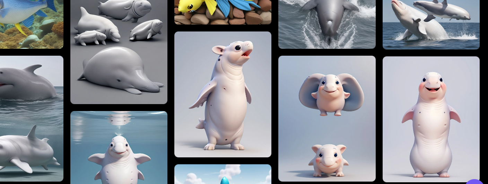
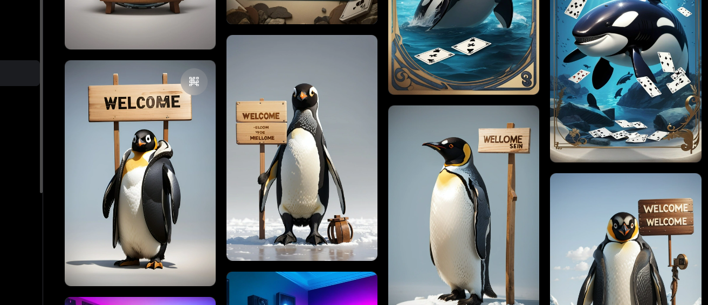
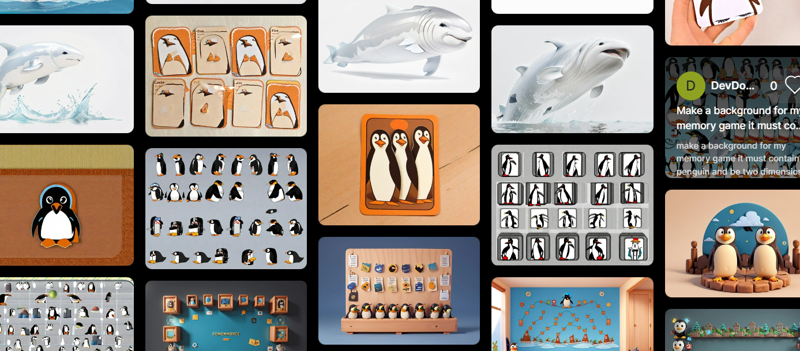

## Jogo da Memória

### Etapas do projeto:
1. Prototipagem
2. Desenvolvimento do HTML das 5 telas
3. CSS
4. Implementação da interatividade pelo Javascript

### Prototipagem
O protótipo foi desenvolvido no Figma:
<div>

<br/>

</div>

Para fazer a tela de login, eu me inspirei principalmente nesta tela do jogo online dos Jovens Titãs (Batalha de Saltos 2).

<div>
    
</div>
<br>
Para fazer a tela de escolher os animais, me baseei nessa imagem.

<div>
 
</div>

As imagens usadas no projeto  foram geradas através de inteligência artificial, incluindo o ***Leonardo.AI, BlueWillow e lexica.ai**
<div>
 
 
 

</div>

 Quanto à paleta de cores, baseei minhas decisões nas imagens. No final, escolhi por usar as cores marrom, laranja e azul claro.

### HTML

A parte mais rápida do projeto foi desenvolver o HTML. Como eu já havia dividido bem os frames no Figma, eu já sabia o que fazer.

### CSS

Eu utilizei apenas um arquivo CSS para o projeto inteiro. O principal problema com o CSS foi a responsividade (já explico logo abaixo o motivo).

### JavaScript

#### O JavaScript foi desenvolvido em partes:

1. Direcionamento para as telas de acordo com o botão escolhido pelo jogador (1 jogador) ou (2 jogadores).

2. Interações do botão na segunda tela (a tela de escolher o animal).

3. A aplicação da mensagem de vencedor, verificação de quem ganhou e mudança de turno do jogador foram feitas por último.


## O PRINCIPAL PROBLEMA


Um grande erro deste projeto foi na fase de prototipagem. Como era a minha primeira vez criando um projeto no Figma, não lembrei de priorizar a experiência móvel. Comecei criando a tela para desktop, mas depois percebi a necessidade de adaptar as imagens, o layout e proporcionar uma boa experiência para o usuário no mobile. Isso envolveu garantir que os botões fossem grandes o suficiente para toques precisos e tornar todo o design responsivo.

Porém, tive muita dificuldade em adaptar todo o conteúdo para telas pequenas. Eu tentei, mas não ficou bom. Ficou péssimo. Como resultado, **o projeto acabou com uma responsividade ruim**. Mas, achei que ainda era funcional, especialmente para desktop, então decidi incluí-lo no meu portfólio. **Eu não repeti esse erro no meu próximo projeto(inspiration4)**, onde comecei tudo pelo mobile, desde a prototipagem até o desenvolvimento.

## Como clonar o repositório
 Você precisa ter o [Git](https://git-scm.com/)  instalado na sua máquina

1. Abra seu terminal ou prompt de comando.
2. Digite o código:
```bash
git clone https://github.com/rafaelcarlosoficial/memory
```

